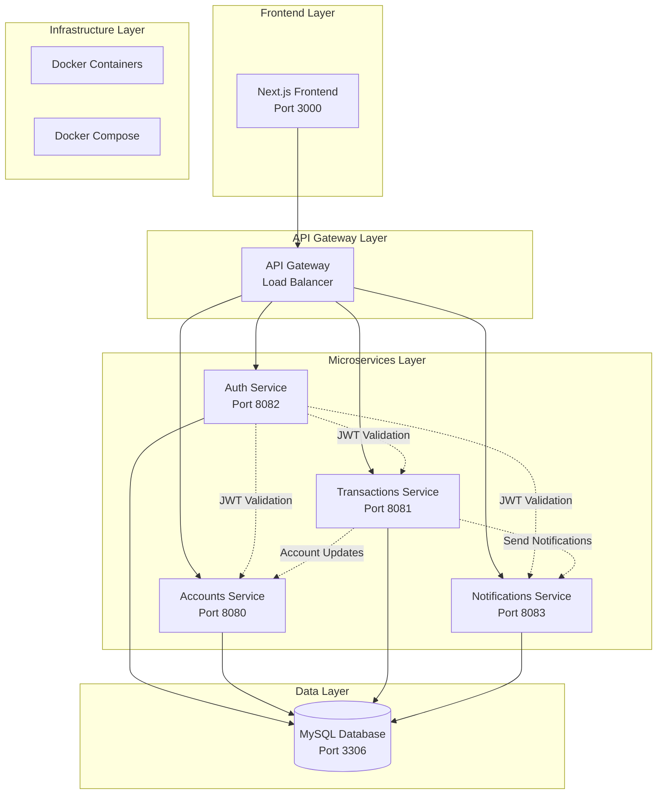
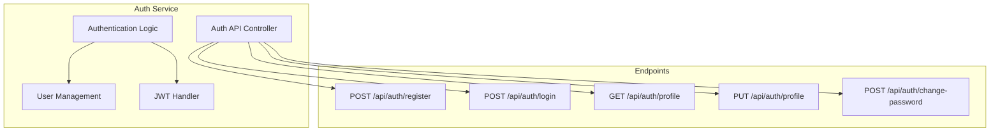
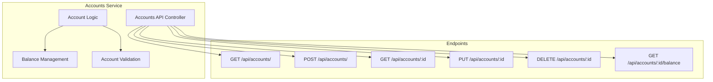
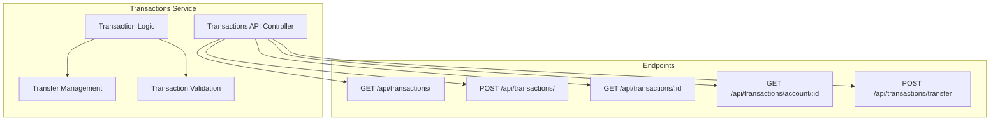
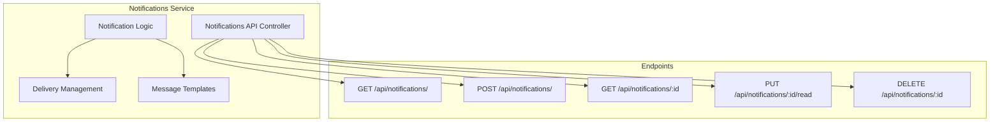
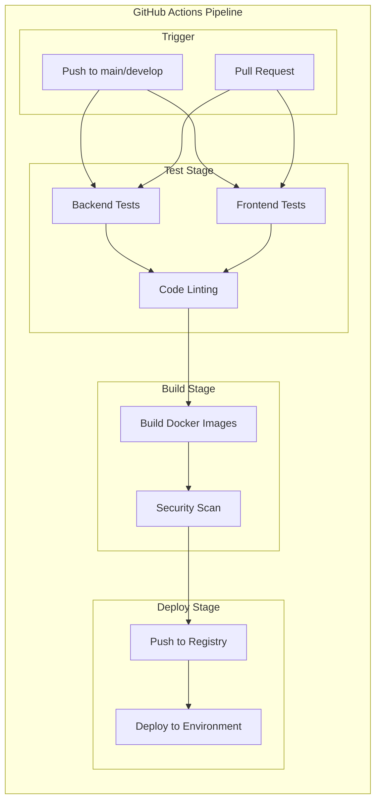
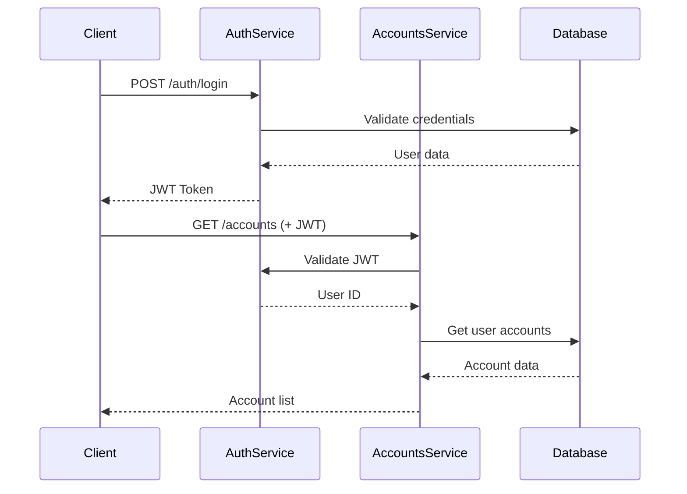
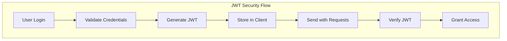
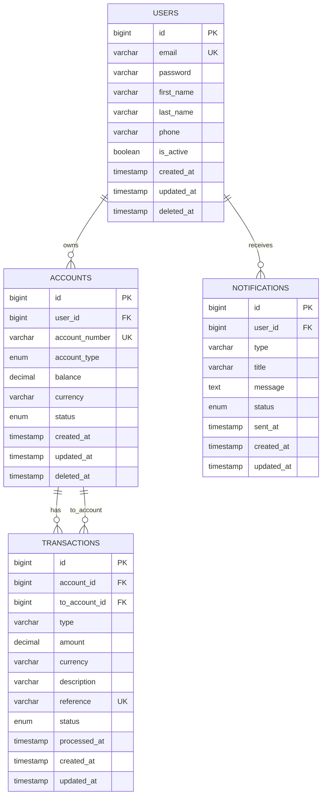

# Architecture du Projet Banking Application

## Table des matières

1. [Vue d'ensemble de l'architecture](#vue-densemble-de-larchitecture)
2. [Architecture des microservices](#architecture-des-microservices)
3. [Infrastructure DevOps](#infrastructure-devops)
4. [Communication inter-services](#communication-inter-services)
5. [Sécurité et authentification](#sécurité-et-authentification)
6. [Base de données et persistance](#base-de-données-et-persistance)
7. [Monitoring et observabilité](#monitoring-et-observabilité)

## Vue d'ensemble de l'architecture

Le projet Banking Application implémente une architecture microservices complète avec des pratiques DevOps modernes. L'application est divisée en plusieurs services indépendants, chacun ayant sa propre responsabilité dans l'écosystème bancaire.

### Architecture globale



### Stack technologique

- **Frontend** : Next.js 14, React 18, TypeScript, Tailwind CSS
- **Backend** : Go 1.21, Gin Framework
- **Base de données** : MySQL 8.0
- **Conteneurisation** : Docker, Docker Compose
- **CI/CD** : GitHub Actions
- **Authentification** : JWT (JSON Web Tokens)
- **Testing** : Jest (Frontend), Go Test (Backend)

## Architecture des microservices

### Service d'authentification (Auth Service)

**Port** : 8082  
**Responsabilités** :
- Gestion des utilisateurs (inscription, connexion)
- Génération et validation des tokens JWT
- Gestion des profils utilisateur
- Changement de mots de passe



**Fonctionnalités clés** :
- Hachage sécurisé des mots de passe (bcrypt)
- Validation des données d'entrée
- Gestion des sessions utilisateur
- Middleware d'authentification partagé

### Service de gestion des comptes (Accounts Service)

**Port** : 8080  
**Responsabilités** :
- Création et gestion des comptes bancaires
- Consultation des soldes
- Mise à jour des statuts de compte
- Génération des numéros de compte



**Types de comptes supportés** :
- `checking` : Compte courant
- `savings` : Compte épargne
- `credit` : Compte de crédit

### Service de transactions (Transactions Service)

**Port** : 8081  
**Responsabilités** :
- Traitement des transactions bancaires
- Gestion des transferts entre comptes
- Historique des transactions
- Validation des fonds disponibles



**Types de transactions** :
- `debit` : Débit (retrait)
- `credit` : Crédit (dépôt)
- `transfer` : Transfert entre comptes

### Service de notifications (Notifications Service)

**Port** : 8083  
**Responsabilités** :
- Gestion des notifications utilisateur
- Envoi d'alertes et messages
- Marquage des notifications comme lues
- Types de notifications multiples



**Types de notifications** :
- `email` : Notifications par email
- `sms` : Notifications par SMS
- `push` : Notifications push
- `system` : Notifications système

## Infrastructure DevOps

### Conteneurisation avec Docker

Chaque service est conteneurisé avec Docker pour assurer la portabilité et l'isolation :

```mermaid
graph TB
    subgraph "Docker Architecture"
        subgraph "Auth Container"
            AUTH_IMG[Go Alpine Image]
            AUTH_BIN[Auth Binary]
        end
        
        subgraph "Accounts Container"
            ACC_IMG[Go Alpine Image]
            ACC_BIN[Accounts Binary]
        end
        
        subgraph "Transactions Container"
            TXN_IMG[Go Alpine Image]
            TXN_BIN[Transactions Binary]
        end
        
        subgraph "Notifications Container"
            NOTIF_IMG[Go Alpine Image]
            NOTIF_BIN[Notifications Binary]
        end
        
        subgraph "Frontend Container"
            FE_IMG[Node Alpine Image]
            FE_APP[Next.js App]
        end
        
        subgraph "Database Container"
            DB_IMG[MySQL 8.0 Image]
            DB_DATA[Persistent Data]
        end
    end
    
    subgraph "Docker Network"
        NETWORK[banking-network]
    end
    
    AUTH_IMG --> NETWORK
    ACC_IMG --> NETWORK
    TXN_IMG --> NETWORK
    NOTIF_IMG --> NETWORK
    FE_IMG --> NETWORK
    DB_IMG --> NETWORK
```



### Orchestration avec Docker Compose

Le fichier `docker-compose.yml` définit l'ensemble de l'infrastructure :

**Services définis** :
- `mysql` : Base de données MySQL avec persistence
- `auth-service` : Service d'authentification
- `accounts-service` : Service de gestion des comptes
- `transactions-service` : Service de transactions
- `notifications-service` : Service de notifications
- `frontend` : Application frontend Next.js

**Configuration réseau** :
- Réseau bridge personnalisé `banking-network`
- Communication inter-services par nom de service
- Exposition des ports nécessaires vers l'hôte

### Pipeline CI/CD avec GitHub Actions



**Étapes du pipeline** :
1. **Tests automatisés** : Tests unitaires et d'intégration
2. **Analyse de code** : Linting et vérification de qualité
3. **Build des images** : Création des images Docker
4. **Scan de sécurité** : Analyse de vulnérabilités avec Trivy
5. **Déploiement** : Push vers registry et déploiement

### Makefile pour l'automatisation

Le `Makefile` fournit une interface unifiée pour toutes les opérations :

```makefile
# Principales commandes disponibles
make install    # Installation des dépendances
make dev        # Lancement de l'environnement de développement
make test       # Exécution de tous les tests
make build      # Build de l'application
make docker-up  # Démarrage avec Docker Compose
make health     # Vérification de la santé des services
make clean      # Nettoyage des artefacts
```

## Communication inter-services

### Authentification distribuée



### Pattern de communication

**Synchrone** :
- APIs RESTful avec JSON
- Authentification via JWT dans les headers
- Validation centralisée des tokens

**Middleware d'authentification partagé** :
```go
func AuthMiddleware() gin.HandlerFunc {
    return func(c *gin.Context) {
        // Extraction et validation du JWT
        // Ajout de l'user_id au contexte
        c.Set("user_id", userID)
        c.Next()
    }
}
```

### Gestion des erreurs et resilience

**Circuit Breaker Pattern** :
- Timeout sur les appels inter-services
- Retry logic avec backoff exponentiel
- Fallback strategies pour la résilience

**Health Checks** :
- Endpoint `/health` sur chaque service
- Vérification de la connectivité base de données
- Monitoring automatisé via Docker Compose

## Sécurité et authentification

### JWT (JSON Web Tokens)



**Configuration JWT** :
- Algorithme : HMAC SHA256
- Secret partagé entre services
- Expiration configurable
- Claims personnalisés (user_id)

### Sécurité des mots de passe

```go
// Hachage avec bcrypt
func HashPassword(password string) (string, error) {
    return bcrypt.GenerateFromPassword([]byte(password), bcrypt.DefaultCost)
}

// Vérification
func CheckPasswordHash(password, hash string) bool {
    return bcrypt.CompareHashAndPassword([]byte(hash), []byte(password)) == nil
}
```

### Validation des données

**Validation côté backend** :
- Gin binding pour la validation automatique
- Validation personnalisée pour les règles métier
- Sanitisation des entrées utilisateur

**Validation côté frontend** :
- TypeScript pour la sécurité des types
- Validation des formulaires avec React Hook Form
- Validation côté client et serveur

## Base de données et persistance

### Schéma de base de données



### Gestion des migrations

**Structure des migrations** :
```
database/migrations/
├── 001_initial_schema.up.sql    # Création du schéma initial
├── 001_initial_schema.down.sql  # Rollback du schéma
```

**Commandes disponibles** :
```bash
make migrate-up      # Appliquer les migrations
make migrate-down    # Rollback des migrations
make migrate-create  # Créer une nouvelle migration
```

### Patterns de persistance

**Repository Pattern** :
- Abstraction de l'accès aux données
- GORM comme ORM pour Go
- Transactions database pour la cohérence

**Database per Service** :
- Isolation des données par service
- Schéma partagé mais accès contrôlé
- Migrations indépendantes

## Monitoring et observabilité

### Health Checks

Chaque service expose un endpoint de santé :

```go
r.GET("/health", func(c *gin.Context) {
    c.JSON(http.StatusOK, gin.H{
        "status":  "healthy",
        "service": "auth",
    })
})
```

### Logging structuré

**Format des logs** :
- Logs structurés en JSON
- Niveaux de log configurables
- Contexte de requête inclus

**Centralisation** :
- Collecte via Docker logs
- Agrégation possible avec ELK Stack
- Corrélation via request ID

### Métriques et monitoring

**Métriques applicatives** :
- Nombre de requêtes par endpoint
- Temps de réponse des services
- Taux d'erreur par service
- Métriques métier (transactions, comptes créés)

**Infrastructure monitoring** :
- Utilisation CPU/Mémoire des conteneurs
- État des services Docker
- Connectivité base de données

### Commandes de diagnostic

```bash
# Vérification de l'état des services
make status

# Vérification de la santé
make health

# Visualisation des logs
make logs

# Diagnostic de la base de données
make debug-db
```

---

Cette architecture robuste combine les meilleures pratiques DevOps et microservices pour créer une application bancaire scalable, maintenable et sécurisée. L'utilisation de conteneurs Docker, de pipelines CI/CD automatisés et d'une architecture orientée services permet une évolutivité et une fiabilité optimales.
