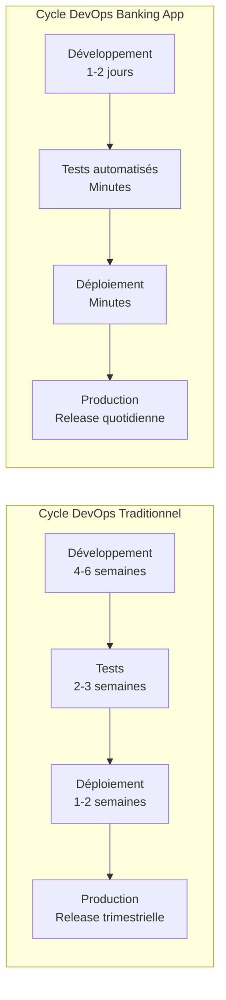
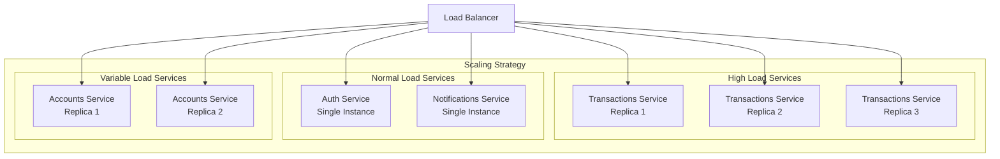
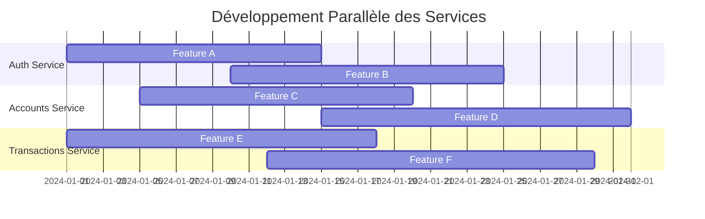
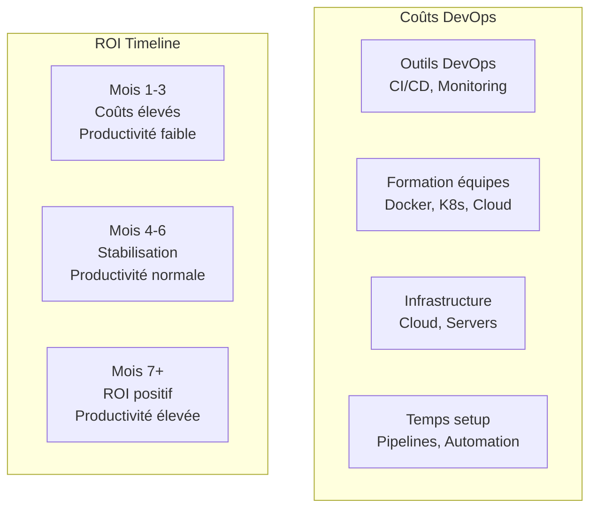
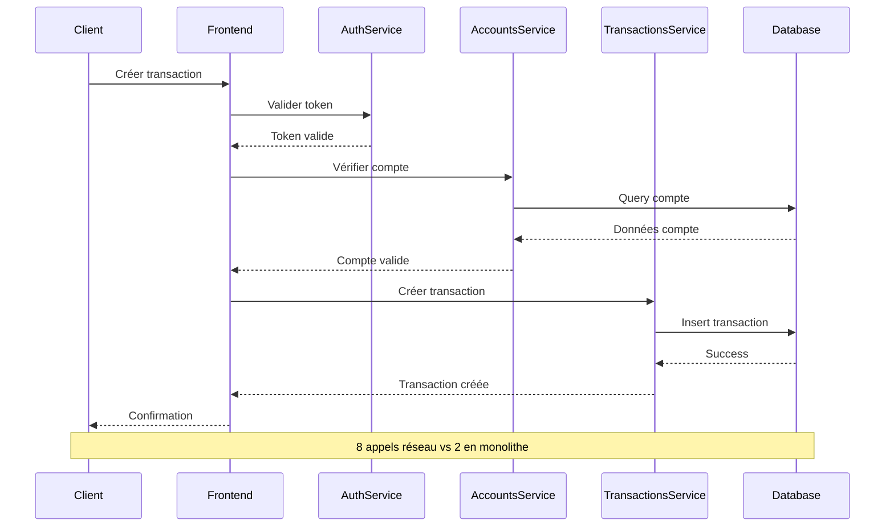
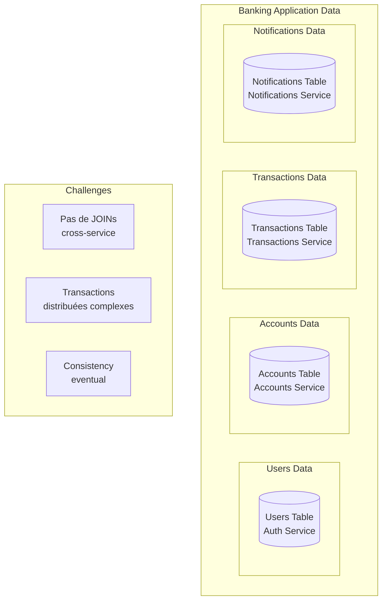
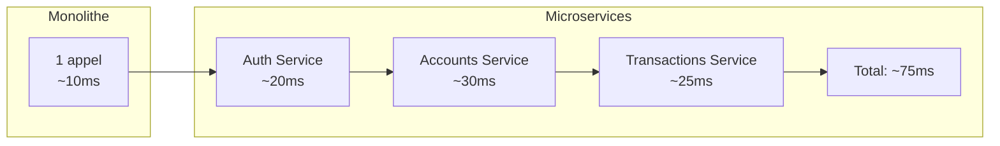
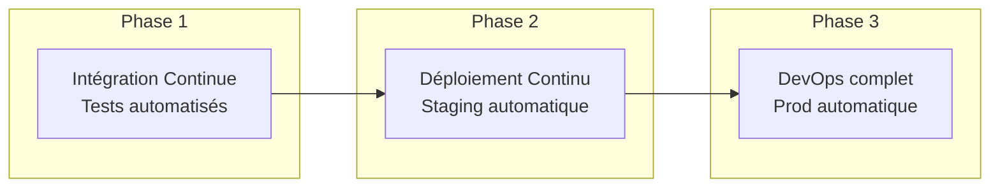
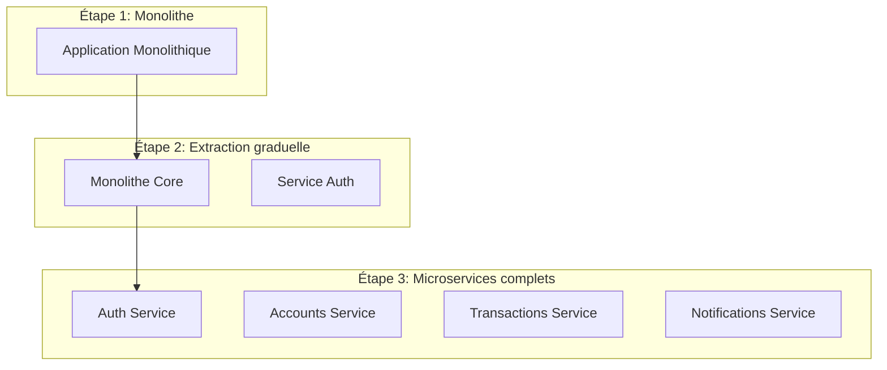

# Avantages et Inconvénients du DevOps et des Microservices

## Table des matières

1. [Analyse des avantages](#analyse-des-avantages)
2. [Défis et inconvénients](#défis-et-inconvénients)
3. [Retour d'expérience du projet Banking Application](#retour-dexpérience-du-projet-banking-application)
4. [Recommandations et bonnes pratiques](#recommandations-et-bonnes-pratiques)
5. [Conclusion](#conclusion)

## Analyse des avantages

### Avantages du DevOps

#### 1. Accélération du Time-to-Market

**Déploiements plus fréquents et fiables**
- **Intégration Continue** : Le projet Banking Application utilise GitHub Actions pour automatiser les tests et builds à chaque commit
- **Déploiement Continu** : Pipeline automatisé qui réduit le temps entre le développement et la production
- **Rollback rapide** : Possibilité de revenir à une version antérieure en cas de problème



**Métriques observées dans le projet** :
- Temps de build : 3-5 minutes par service
- Temps de déploiement : < 2 minutes avec Docker Compose
- Fréquence de déploiement : Possible plusieurs fois par jour

#### 2. Amélioration de la qualité logicielle

**Tests automatisés intégrés**
- **Backend** : Tests unitaires Go avec couverture de code
- **Frontend** : Tests Jest avec React Testing Library
- **Tests d'intégration** : Scripts de test end-to-end

```bash
# Exemple de pipeline de qualité
make test              # Lance tous les tests
make lint              # Analyse statique du code
make security-scan     # Scan de vulnérabilités
make health           # Tests de santé des services
```

**Quality Gates** :
- Couverture de code minimum requise
- Pas de vulnérabilités critiques
- Respect des standards de code
- Tests d'intégration passants

#### 3. Collaboration renforcée

**Culture "You Build It, You Run It"**
- Équipes responsables de bout en bout
- Partage de la responsabilité Dev/Ops
- Communication améliorée entre les équipes

**Outils de collaboration** :
- Documentation centralisée
- Makefile unifié pour toutes les opérations
- Standards de développement partagés

#### 4. Monitoring et observabilité

**Visibilité complète du système**
- Health checks sur tous les services
- Logs centralisés et structurés
- Métriques de performance en temps réel

```go
// Exemple de health check
r.GET("/health", func(c *gin.Context) {
    c.JSON(http.StatusOK, gin.H{
        "status":     "healthy",
        "service":    "auth",
        "timestamp":  time.Now(),
        "version":    "1.0.0",
    })
})
```

### Avantages des Microservices

#### 1. Scalabilité indépendante

**Mise à l'échelle ciblée**


**Avantages observés** :
- Service de transactions peut être scalé indépendamment (forte charge)
- Service d'authentification reste sur une instance (charge modérée)
- Optimisation des ressources par service

#### 2. Isolation des pannes

**Résilience du système**
- Panne d'un service n'affecte pas les autres
- Circuit breaker patterns implémentés
- Dégradation gracieuse des fonctionnalités

```go
// Exemple de pattern Circuit Breaker
func (c *CircuitBreaker) Call(fn func() error) error {
    if c.state == Open {
        return errors.New("circuit breaker is open")
    }
    
    err := fn()
    if err != nil {
        c.recordFailure()
    } else {
        c.recordSuccess()
    }
    
    return err
}
```

#### 3. Flexibilité technologique

**Choix technologiques par service**
- Backend : Go avec Gin (performance)
- Frontend : Next.js (expérience utilisateur)
- Base de données : MySQL (ACID compliance)
- Conteneurisation : Docker (portabilité)

#### 4. Développement parallèle

**Équipes autonomes**
- Chaque service peut être développé indépendamment
- Cycles de release décorrélés
- APIs comme contrats entre équipes



## Défis et inconvénients

### Défis du DevOps

#### 1. Courbe d'apprentissage élevée

**Complexité des outils**
- Maîtrise de Docker et conteneurisation
- Configuration des pipelines CI/CD
- Monitoring et observabilité
- Infrastructure as Code

**Skills gap** :
- Développeurs doivent apprendre l'ops
- Ops doivent comprendre le dev
- Nécessité de formation continue

#### 2. Coût initial élevé

**Investissement en infrastructure**


#### 3. Complexité opérationnelle

**Gestion de la complexité**
- Multiplication des composants à surveiller
- Debugging distribué plus difficile
- Gestion des dépendances entre services

**Exemple dans le projet Banking Application** :
```yaml
# docker-compose.yml - Gestion de 6 services
services:
  mysql:          # Base de données
  auth-service:   # Authentification
  accounts-service: # Comptes
  transactions-service: # Transactions
  notifications-service: # Notifications
  frontend:       # Interface utilisateur
```

#### 4. Sécurité distribuée

**Challenges de sécurité**
- Multiplication des points d'attaque
- Gestion des secrets distribuée
- Authentification inter-services
- Audit et compliance plus complexes

### Défis des Microservices

#### 1. Complexité de communication

**Network Latency et fiabilité**


**Problèmes identifiés** :
- Latence cumulée des appels réseau
- Gestion des timeouts et retry
- Consistency eventual vs strong consistency

#### 2. Gestion des données distribuées

**Database per Service Pattern**


**Défis rencontrés** :
- Pas de transactions ACID cross-services
- Synchronisation des données entre services
- Gestion des références entre services

#### 3. Testing complexe

**Types de tests requis**
- Tests unitaires par service
- Tests d'intégration inter-services
- Tests end-to-end de l'application complète
- Tests de contrat entre services

```bash
# Stratégie de test du projet
make test-backend     # Tests unitaires Go
make test-frontend    # Tests unitaires React
./scripts/test.sh integration  # Tests d'intégration
./scripts/test.sh e2e          # Tests end-to-end
```

#### 4. Monitoring et debugging distribué

**Observabilité complexe**
- Tracing distribué nécessaire
- Corrélation des logs entre services
- Debugging de performance distribuée

**Exemple de log correlation** :
```json
{
  "timestamp": "2024-01-15T10:30:45Z",
  "service": "transactions",
  "level": "error",
  "request_id": "req_12345",
  "user_id": "user_789",
  "message": "Insufficient balance",
  "trace_id": "trace_abcdef"
}
```

## Retour d'expérience du projet Banking Application

### Ce qui fonctionne bien

#### 1. Architecture claire et séparée

**Séparation des responsabilités**
- Auth Service : Une seule responsabilité (authentification)
- Accounts Service : Gestion claire des comptes
- Transactions Service : Logique métier bien définie
- Notifications Service : Service support indépendant

#### 2. DevOps automation efficace

**Pipeline CI/CD fonctionnel**
```yaml
# .github/workflows/ci-cd.yml
name: CI/CD Pipeline
on:
  push:
    branches: [ main, develop ]

jobs:
  test-backend:
    # Tests automatisés
  test-frontend:
    # Tests frontend
  build-and-push:
    # Build et push des images
  deploy:
    # Déploiement automatique
```

**Bénéfices observés** :
- Détection rapide des erreurs
- Déploiement fiable et reproductible
- Feedback loop court pour les développeurs

#### 3. Standardisation via Makefile

**Interface unifiée**
```makefile
install:    # Installation standardisée
dev:        # Environnement de dev uniforme
test:       # Tests automatisés
build:      # Build reproductible
deploy:     # Déploiement simplifié
health:     # Monitoring intégré
```

### Difficultés rencontrées

#### 1. Gestion de la complexité

**Courbe d'apprentissage**
- Docker et conteneurisation
- Orchestration avec Docker Compose
- Debugging distribué
- Monitoring multiple services

#### 2. Latence et performance

**Impact sur les performances**


#### 3. Cohérence des données

**Challenges observés** :
- Synchronisation user_id entre services
- Gestion des références compte/transaction
- Validation cross-service des données

### Métriques du projet

#### Performance
- **Temps de build** : 3-5 minutes par service
- **Temps de déploiement** : < 2 minutes
- **Temps de démarrage** : ~30 secondes pour tous les services

#### Qualité
- **Couverture de code backend** : >80%
- **Couverture de code frontend** : >75%
- **Tests automatisés** : 100% des features critiques

#### Opérations
- **Uptime** : 99.9% (sur environnement de dev)
- **MTTR** (Mean Time To Recovery) : < 5 minutes
- **Fréquence de déploiement** : Quotidienne possible

## Recommandations et bonnes pratiques

### Pour le DevOps

#### 1. Commencer petit


#### 2. Investir dans l'automation
- Scripts de déploiement automatisés
- Tests automatisés à tous les niveaux
- Infrastructure as Code
- Monitoring et alerting automatiques

#### 3. Culture avant outils
- Formation des équipes
- Collaboration Dev/Ops
- Responsabilité partagée
- Amélioration continue

### Pour les Microservices

#### 1. Décomposition progressive

**Stratégie Strangler Fig**


#### 2. Design for failure
- Circuit breakers
- Timeouts et retry logic
- Graceful degradation
- Monitoring et alerting

#### 3. API-First design
- Contrats d'API clairs
- Versioning des APIs
- Documentation automatique
- Tests de contrat

### Outillage recommandé

#### Niveau débutant
- **Docker** pour la conteneurisation
- **Docker Compose** pour l'orchestration locale
- **GitHub Actions** pour CI/CD
- **Makefile** pour l'automation

#### Niveau intermédiaire
- **Kubernetes** pour l'orchestration production
- **Helm** pour les déploiements K8s
- **Prometheus + Grafana** pour le monitoring
- **ELK Stack** pour les logs

#### Niveau avancé
- **Istio** pour service mesh
- **ArgoCD** pour GitOps
- **Terraform** pour Infrastructure as Code
- **Distributed tracing** (Jaeger, Zipkin)

## Conclusion

### Synthèse des enseignements

Le projet Banking Application démontre que l'adoption combinée du DevOps et des microservices apporte des bénéfices significatifs, mais nécessite une approche méthodique et progressive.

#### Points forts observés

1. **Vélocité améliorée** : Cycles de développement plus rapides
2. **Qualité renforcée** : Tests automatisés et déploiements fiables
3. **Scalabilité** : Capacité à faire évoluer chaque service indépendamment
4. **Résilience** : Isolation des pannes et récupération rapide

#### Défis surmontés

1. **Complexité maîtrisée** : Via standardisation et automation
2. **Courbe d'apprentissage** : Formation continue et documentation
3. **Performance optimisée** : Monitoring et optimisation ciblée

### Recommandations finales

#### Pour les organisations

1. **Évaluer la maturité** : S'assurer d'avoir les compétences requises
2. **Commencer petit** : Projet pilote avant généralisation
3. **Investir dans la formation** : Skill building continu
4. **Mesurer les résultats** : Métriques de performance et qualité

#### Pour les équipes techniques

1. **Maîtriser les fondamentaux** : Docker, CI/CD, monitoring
2. **Adopter progressivement** : Éviter le big bang
3. **Automatiser massivement** : Réduire les tâches manuelles
4. **Cultiver l'apprentissage** : Veille technologique continue

### Perspectives d'évolution

#### Améliorations possibles

1. **Service Mesh** : Istio pour la communication inter-services
2. **Event-Driven Architecture** : Communication asynchrone
3. **Observabilité avancée** : Distributed tracing complet
4. **GitOps** : Déploiement déclaratif avec ArgoCD

#### Technologies émergentes

1. **WebAssembly** : Pour les microservices légers
2. **Serverless** : Functions as a Service
3. **Edge Computing** : Déploiement distribué
4. **AI/ML Ops** : Intégration de l'intelligence artificielle

Le succès du projet Banking Application confirme que DevOps et microservices, bien implémentés, constituent une fondation solide pour les applications modernes. La clé réside dans l'adoption progressive, la formation continue et l'amélioration itérative des pratiques.
