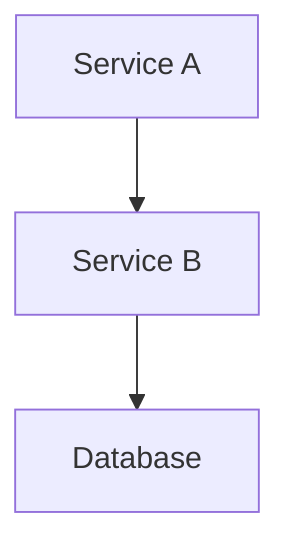

# Guide de Contribution - Documentation Banking Application

## 📋 Objectif

Ce guide établit les standards pour maintenir et améliorer la documentation du projet Banking Application. Il assure la cohérence, la qualité et l'utilité de tous les documents.

## 🏗️ Structure de la Documentation

```
docs/
├── README.md                    # Index principal et vue d'ensemble
├── 01-devops-microservices.md  # Théorie et concepts fondamentaux
├── 02-architecture-projet.md   # Architecture technique détaillée
├── 03-avantages-inconvenients.md # Analyse critique et retour d'expérience
├── 04-synthese-executive.md    # Vue stratégique et points clés
└── CONTRIBUTING.md             # Ce guide de contribution
```

## ✅ Standards de Qualité

### Contenu
- **Précision technique** : Vérifier tous les détails techniques
- **Clarté** : Éviter le jargon excessif, expliquer les concepts
- **Exhaustivité** : Couvrir tous les aspects pertinents
- **Pertinence** : Maintenir l'alignement avec le projet actuel

### Format
- **Markdown** : Utiliser la syntaxe Markdown standard
- **Structure** : Hiérarchie claire avec H1, H2, H3
- **Lisibilité** : Paragraphes courts, listes à puces
- **Visuels** : Diagrammes Mermaid pour l'architecture

### Style
- **Ton professionnel** mais accessible
- **Objectivité** dans l'analyse critique
- **Exemples concrets** du projet
- **Sources** et références quand approprié

## 🔄 Processus de Mise à Jour

### 1. Identification du Besoin
- **Changement d'architecture** → Mettre à jour `02-architecture-projet.md`
- **Nouvelles pratiques DevOps** → Mettre à jour `01-devops-microservices.md`
- **Retour d'expérience** → Mettre à jour `03-avantages-inconvenients.md`
- **Métriques business** → Mettre à jour `04-synthese-executive.md`

### 2. Modification
1. Lire le document existant
2. Identifier les sections à modifier
3. Apporter les changements nécessaires
4. Vérifier la cohérence avec les autres documents

### 3. Validation
- **Exactitude technique** : Vérifier les détails
- **Cohérence** : Alignement entre tous les documents
- **Qualité** : Orthographe, grammaire, formatage
- **Utilité** : Valeur ajoutée pour le lecteur

## 📐 Templates et Conventions

### Titres
```markdown
# Titre Principal (H1) - Un seul par document
## Section Majeure (H2)
### Sous-section (H3)
#### Détail (H4) - À utiliser avec parcimonie
```

### Diagrammes Mermaid
```markdown

```

### Tableaux
```markdown
| Critère | Valeur | Commentaire |
|---------|--------|-------------|
| Performance | 95% | Excellent |
```

### Code et Commandes
```markdown
# Commandes terminal
`docker-compose up`

# Blocs de code
```bash
make build
make test
```
```

### Alertes et Callouts
```markdown
> ⚠️ **Attention** : Point important à retenir

> 💡 **Astuce** : Conseil pratique

> ✅ **Succès** : Résultat positif

> ❌ **Problème** : Point d'attention
```

## 🎯 Bonnes Pratiques

### Écriture
1. **Commencer par l'essentiel** : Points clés en début de section
2. **Utiliser des exemples** : Illustrer avec des cas concrets
3. **Être spécifique** : Éviter les généralités
4. **Maintenir l'objectivité** : Présenter avantages ET inconvénients

### Maintenance
1. **Révision périodique** : Tous les 3-6 mois
2. **Versionning** : Noter les changements significatifs
3. **Feedback** : Intégrer les retours des utilisateurs
4. **Évolution** : Adapter à l'évolution du projet

### Collaboration
1. **Communication** : Informer l'équipe des modifications
2. **Cohérence** : Coordonner les mises à jour entre documents
3. **Expertise** : Faire relire par des experts techniques
4. **Accessibilité** : S'assurer que tous peuvent comprendre

## 🔍 Checklist de Révision

Avant de finaliser une modification :

### Contenu
- [ ] Information techniquement correcte
- [ ] Exemples à jour avec le code actuel
- [ ] Références et liens fonctionnels
- [ ] Diagrammes reflètent l'architecture actuelle

### Format
- [ ] Syntaxe Markdown correcte
- [ ] Hiérarchie de titres logique
- [ ] Formatage cohérent (tableaux, listes)
- [ ] Diagrammes Mermaid valides

### Qualité
- [ ] Orthographe et grammaire correctes
- [ ] Phrases claires et concises
- [ ] Transition logique entre sections
- [ ] Conclusion appropriée

### Intégration
- [ ] Cohérence avec les autres documents
- [ ] Index (README.md) mis à jour si nécessaire
- [ ] Liens croisés fonctionnels
- [ ] Métriques et données actualisées

## 📊 Métriques de Documentation

Pour évaluer la qualité :

### Quantitatives
- **Longueur** : 2000-5000 mots par document principal
- **Structure** : 3-7 sections principales
- **Visuels** : 2-5 diagrammes par document technique
- **Liens** : 5-15 références externes

### Qualitatives
- **Utilité** : Répond aux questions fréquentes
- **Clarté** : Compréhensible par l'audience cible
- **Actualité** : Reflète l'état actuel du projet
- **Complétude** : Couvre tous les aspects nécessaires

## 🚀 Évolution Future

### Améliorations Prévues
1. **Automatisation** : Scripts de validation des liens
2. **Interactivité** : Diagrammes interactifs
3. **Multimédia** : Captures d'écran, vidéos
4. **Localisation** : Versions en différentes langues

### Outils d'Amélioration
- **Linting** : markdownlint pour la cohérence
- **Génération** : Scripts pour les métriques automatiques
- **Validation** : Tests pour les liens et la syntaxe
- **Publication** : GitHub Pages ou GitBook

---

**Maintenir une documentation de qualité est un investissement qui bénéficie à toute l'équipe et aux futurs contributeurs du projet.**
