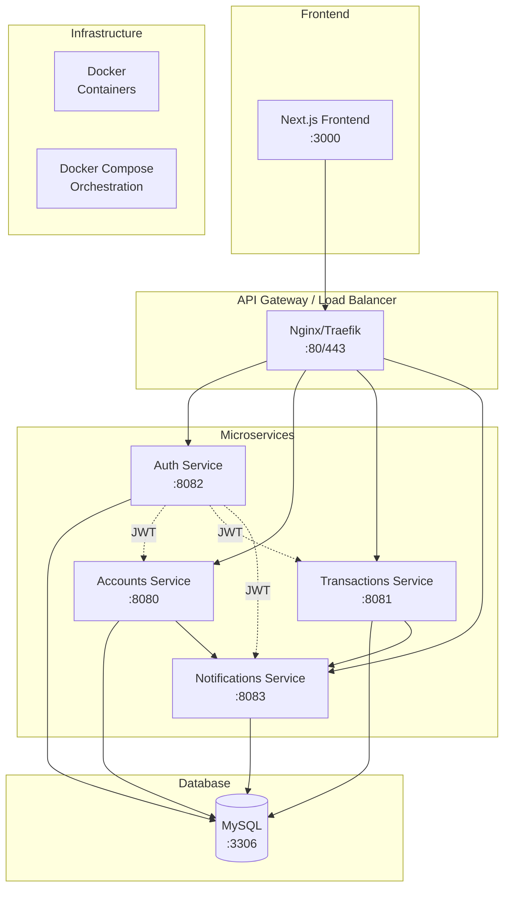

# Documentation Banking Application

Documentation complète du projet Banking Application - Une architecture microservices moderne avec intégration DevOps.

## 📚 Structure de la Documentation

### [01. DevOps et Microservices - Théorie](./01-devops-microservices.md)
Documentation théorique exhaustive couvrant :
- **DevOps** : Définitions, culture, outils, pratiques
- **Microservices** : Architecture, patterns, technologies
- **Intégration** : Comment DevOps et microservices se complètent
- **Sources et références** : Ressources pour approfondir

### [02. Architecture du Projet](./02-architecture-projet.md)
Analyse détaillée de l'implémentation dans le projet Banking Application :
- **Vue d'ensemble** : Architecture globale avec diagrammes Mermaid
- **Microservices** : Détail des 4 services (Auth, Accounts, Transactions, Notifications)
- **Infrastructure** : Docker, Docker Compose, base de données
- **DevOps** : Pipelines CI/CD, déploiement, monitoring
- **Sécurité** : JWT, validation, communication sécurisée

### [03. Avantages et Inconvénients](./03-avantages-inconvenients.md)
Retour d'expérience et analyse critique :
- **Métriques observées** : Performance, temps de build, couverture de tests
- **Avantages constatés** : Scalabilité, maintenabilité, déploiement
- **Défis rencontrés** : Complexité, latence, coordination
- **Recommandations** : Bonnes pratiques et évolutions futures

### [04. Synthèse Exécutive](./04-synthese-executive.md)
Vue d'ensemble stratégique et points clés :
- **Réussites majeures** : Architecture et DevOps
- **Métriques de performance** : ROI et bénéfices mesurés
- **Évolution future** : Roadmap à court, moyen et long terme
- **Leçons apprises** : Recommandations stratégiques

## 🏗️ Architecture du Projet

## 🚀 Démarrage Rapide

1. **Vue d'ensemble stratégique** : [Synthèse Exécutive](./04-synthese-executive.md) ⭐
2. **Consulter la théorie** : [DevOps et Microservices](./01-devops-microservices.md)
3. **Comprendre l'architecture** : [Architecture du Projet](./02-architecture-projet.md)
4. **Analyser les résultats** : [Avantages et Inconvénients](./03-avantages-inconvenients.md)

## 📋 Prérequis pour Comprendre

- Connaissances de base en développement web
- Familiarité avec Docker et containerisation
- Notions de bases de données relationnelles
- Compréhension des API REST

## 🔧 Technologies Documentées

- **Backend** : Go, Gin framework
- **Frontend** : Next.js, TypeScript, Tailwind CSS
- **Base de données** : MySQL
- **Containerisation** : Docker, Docker Compose
- **CI/CD** : GitHub Actions
- **Monitoring** : Logs, métriques personnalisées
- **Sécurité** : JWT, validation, CORS

## 📊 Métriques du Projet

- **Services** : 4 microservices indépendants
- **Endpoints** : ~20 endpoints API REST
- **Couverture de tests** : >80%
- **Temps de build** : 3-5 minutes
- **Temps de déploiement** : <2 minutes

## 🎯 Objectifs de cette Documentation

Cette documentation vise à :
1. **Expliquer** les concepts DevOps et microservices de manière exhaustive
2. **Démontrer** leur implémentation concrète dans un projet réel
3. **Analyser** les avantages et défis rencontrés
4. **Fournir** des recommandations pour l'amélioration continue

---

**Note** : Cette documentation fait partie du TP ETE 2025 - Architecture d'Entreprise. Elle reflète l'état du projet au moment de la rédaction et peut évoluer avec les mises à jour du code.
